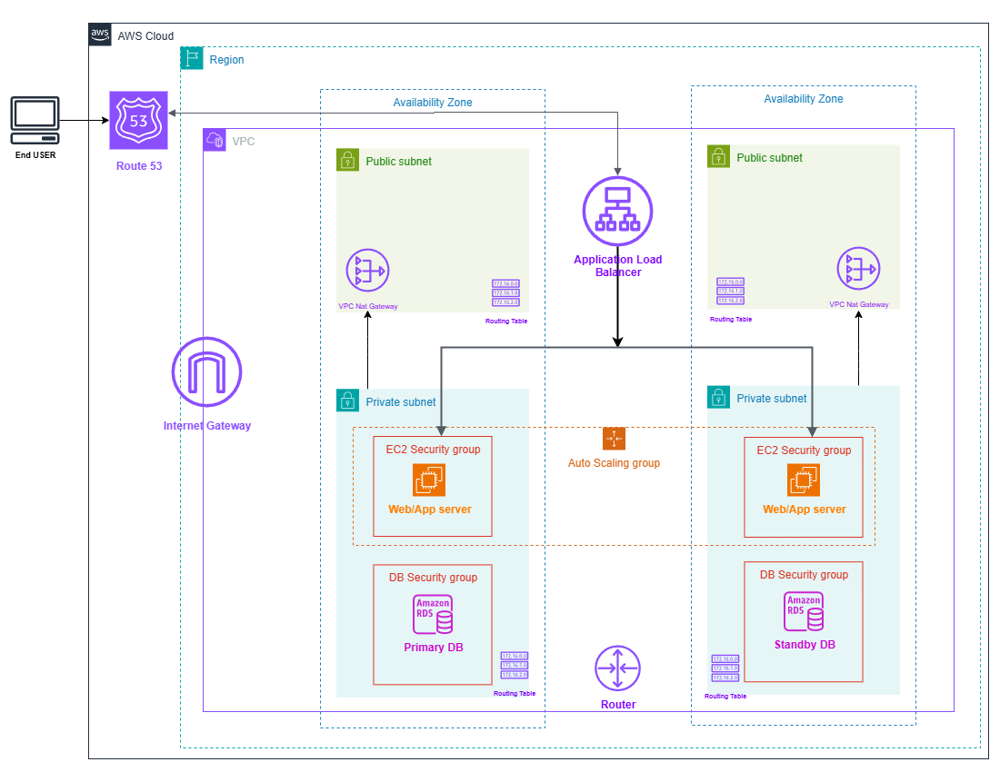

# AWS-High-Availability-Web-App-Architecture

# 🌩️ AWS High Availability Web App Architecture

this is a small project i built as part of my devops/cloud learning journey.

the goal was to design and deploy a **highly available, secure, and scalable** architecture on aws — something real, not just diagrams.

---

## 🛠️ stack

- **route 53** → domain & dns
- **application load balancer (alb)** → traffic distribution in public subnets
- **ec2 auto scaling group** → app servers in private subnets
- **rds multi-az** → database layer
- **vpc** → public + private subnets across 2 azs, with nat & igw

---

## ⚙️ configuration overview

- **VPC**:
    - CIDR: `10.0.0.0/16`
    - 2 public subnets (`10.0.1.0/24`, `10.0.2.0/24`)
    - 2 private subnets (`10.0.3.0/24`, `10.0.4.0/24`)
- **EC2 Auto Scaling Group**:
    - AMI: Amazon Linux 2
    - Instance type: `t3.micro` (demo size)
    - Min: 2, Max: 4 instances
    - User Data script installs Nginx + app
- **RDS (Multi-AZ)**:
    - Engine: MySQL
    - Instance type: `db.t3.micro`
    - Multi-AZ: enabled
    - Public access: disabled
- **Application Load Balancer (ALB)**:
    - Listener: HTTP 80 → forwards to EC2 instances
    - Health checks on `/`
    - Spread across 2 public subnets

---

## ✨ key features

- **high availability** → runs across 2 availability zones
- **scalability** → auto scaling for ec2
- **security** → no direct public access to ec2/db
- **resilience** → multi-az database setup

---

## 📐 architecture diagram

---

## 🚀 what i learned

- how to split workloads into public/private subnets
- connecting alb with instances in an asg
- designing multi-az setups for fault tolerance
- balancing between security and availability

---

## 📌 next steps

- add cloudfront for cdn/distribution
- automate provisioning with terraform or cloudformation
- maybe containerize the app with ecs/eks

---

## 🤝 about

this repo is part of my **devops/cloud engineering journey**.

i’ll keep sharing more projects as i explore different aws services.
